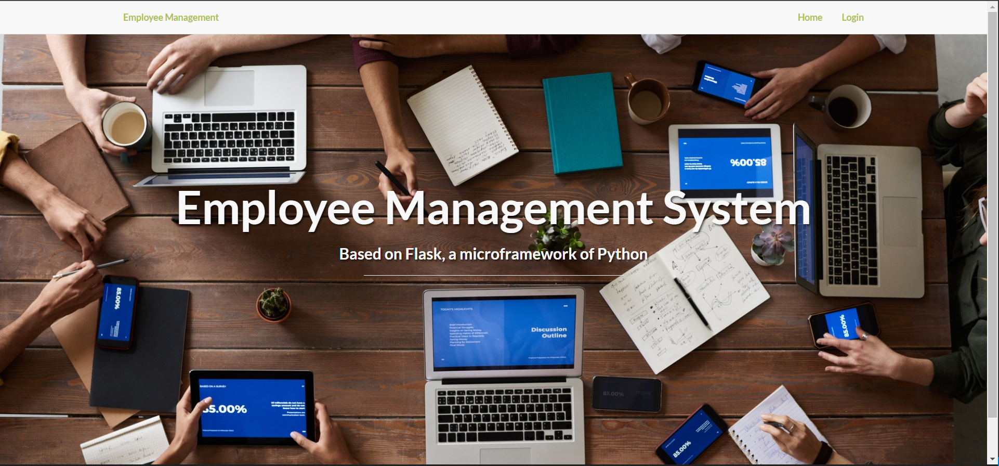
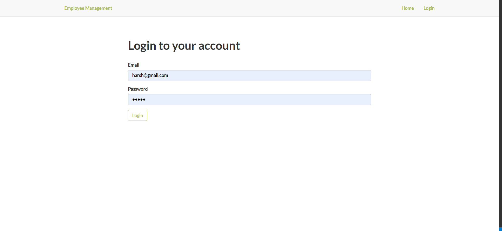
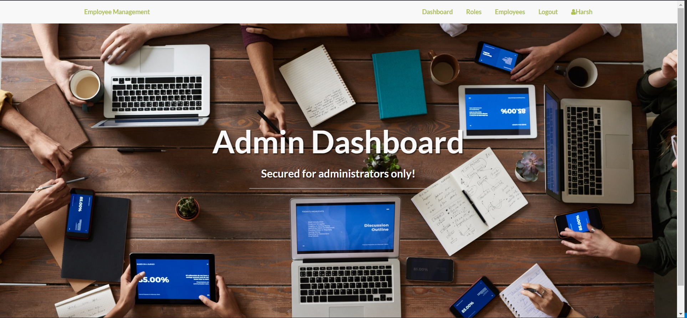
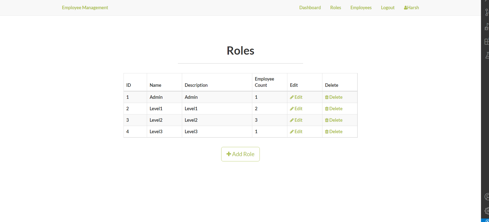
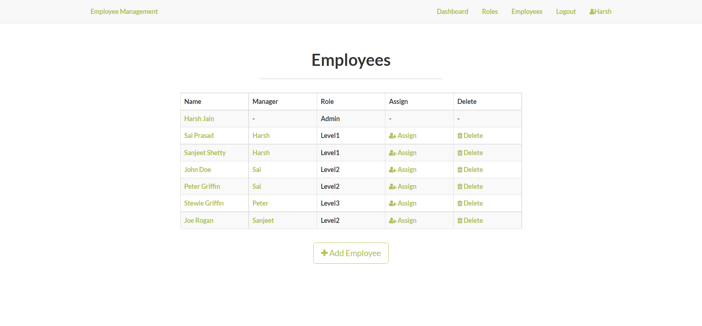
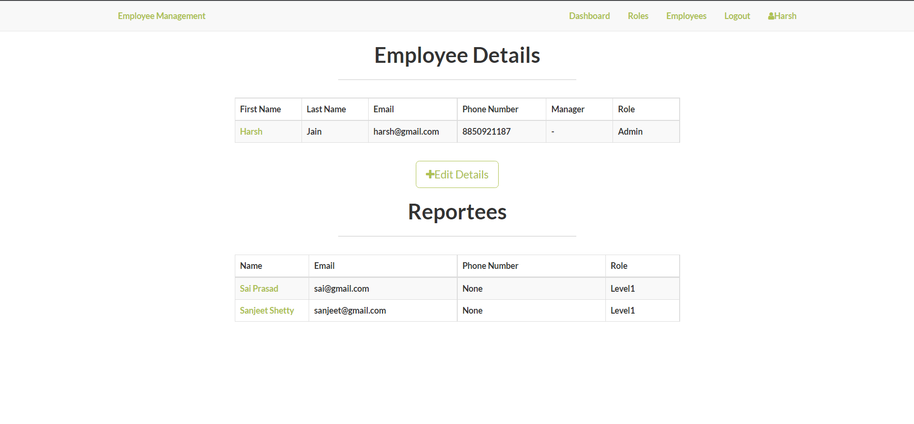
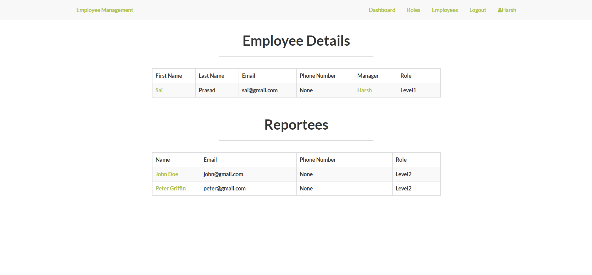
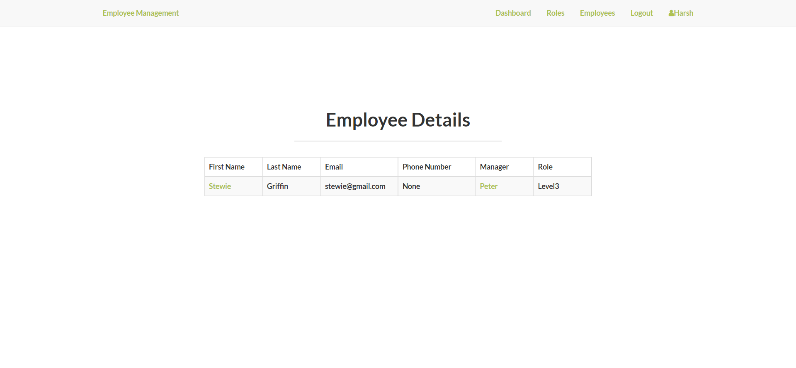
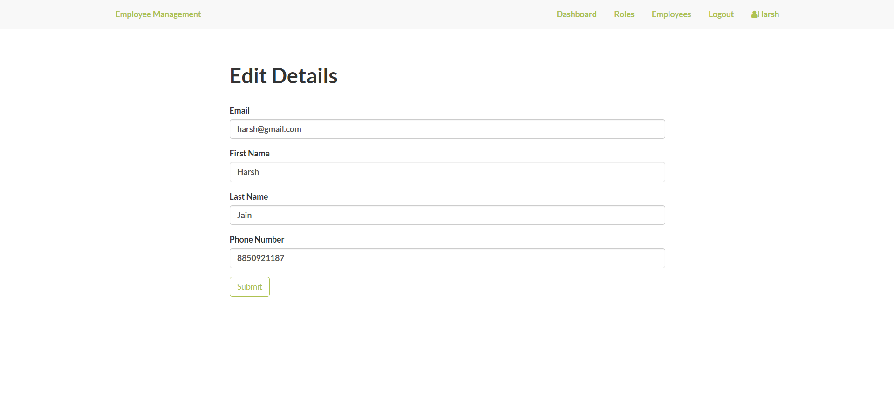
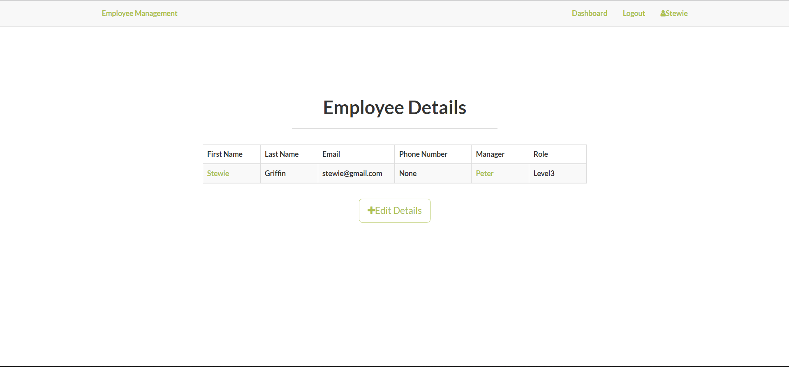

# Employee Management

Home Page when no one is logged in

Login Page

Admin Dashboard

All listed roles - Admin can create new roles

All listed Employees - Admin can create new employees

Edit Profile page of current logged in employee

View Profile Page of some different Employee who is a manager

View Profile Page of some different Employee who is not a manager

Edit Employee Details Form

Dashboard - Non Admin Employees

Edit Profile page of current logged in employee who is not a manager

## Installing Dependencies

    `$ pip install -r requirements.txt`

## Running Application

    `$ python run.py`

## User Details

### Admin
email: harsh@gmail.com
password: admin

All other users have the same password: qwe

